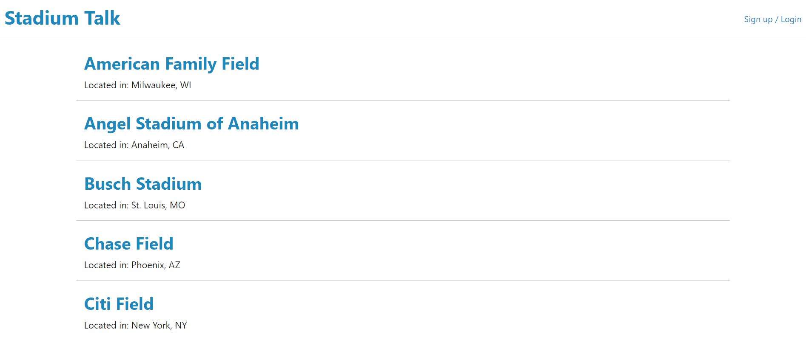
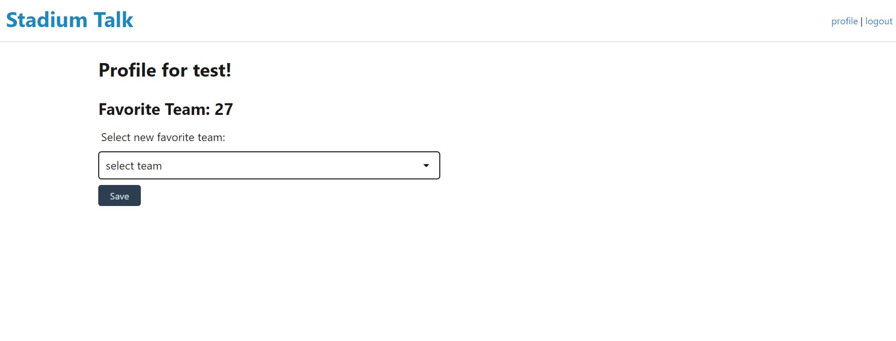

# MLB-stadium-tracker

## Description:
This application allows a user to view a list of MLB stadiums with links to the stadium's website. A user can sign-up or log in and upon logging in, the user can select their favorite team. The user's favorite team will be displayed in their profile and also has the ability to change their favorite team at any time. 

https://mlb-stadium-talk.herokuapp.com/

## User Story:

As a baseball fan and traveller:
I want to see MLB Stadium information that links to the stadium's website. 
When I log in, I want my profile to show me my favorite team (and allow to set/change it).

## Installation:
Node.js, Express.js, Handlebars, Mysql, API, file structure that lines up with MVC paradigm, NodeMailer

## Credits:
Michael Welle: Setup models, figured out handlebars, some api calls from back end to front end. https://github.com/mwelle238
Frederick Dirige: Handlebars, login logout, javascript and adding stadium url to seeds.js. https://github.com/fdirige
Richard Murray: node.js, express.js, Mysql, Sequelize ORM, Slides. https://github.com/RMurray22

## Screenshots:

